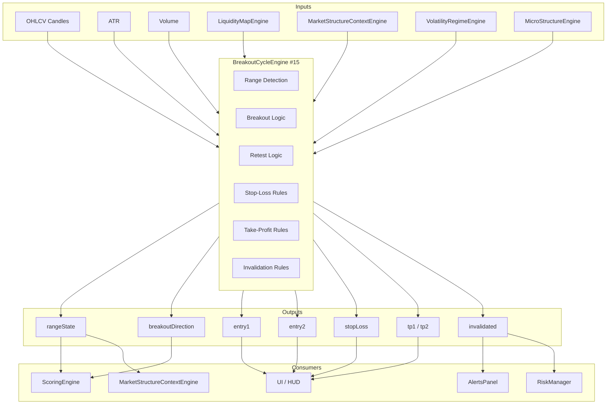
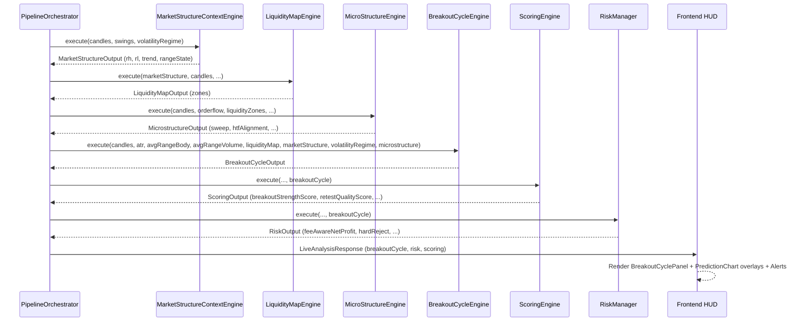
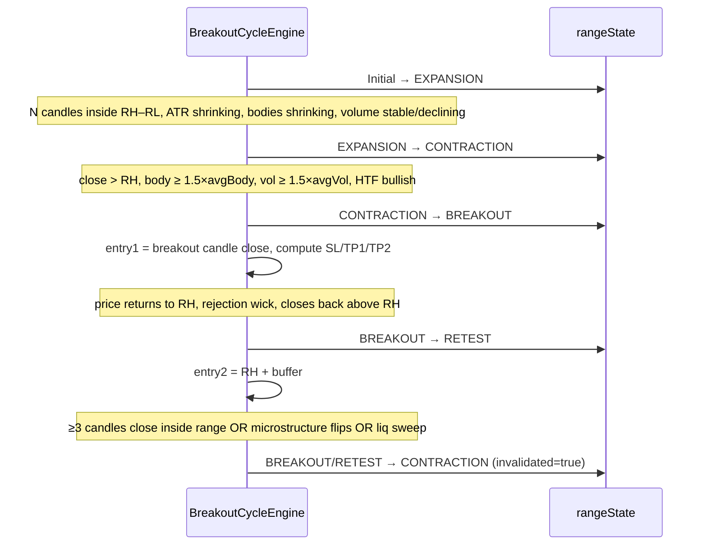

# Design Document: BreakoutCycleEngine (Engine #15)

## Overview

The BreakoutCycleEngine is a deterministic entry/exit engine that identifies range contraction, breakout, and retest phases in price action and emits structured trade-level outputs (entry levels, stop-loss, TP1/TP2) consumed by the RiskManager, ScoringEngine, MarketStructureContextEngine, and the frontend HUD. It is the 15th engine in the pipeline, positioned after OrderflowEngine in the geometry layer, and its output is already partially wired into the existing codebase — the stub implementation, shared types, pipeline orchestrator, scoring engine, risk manager, and frontend panel all exist and need to be completed or extended per this spec.

The engine operates on a state machine with four states — `EXPANSION`, `CONTRACTION`, `BREAKOUT`, `RETEST` — and transitions between them deterministically based on OHLCV data, ATR, volume, HTF trend, microstructure signals, and liquidity map data. All outputs are analytical; trade execution is not in scope.

---

## Architecture



---

## Sequence Diagrams

### Main Pipeline Flow (per cycle)



### Breakout State Transition



---

## Components and Interfaces

### BreakoutCycleEngine

**Purpose**: Detects range phases and emits deterministic entry/exit levels.

**Interface** (already defined in `shared/types/index.ts`):

```typescript
interface BreakoutCycleInput {
    candles: Array<{ high: number; low: number; open: number; close: number; volume: number; timestamp: string }>;
    atr: number;
    avgRangeBody: number;
    avgRangeVolume: number;
    liquidityMap: LiquidityMapOutput;
    marketStructure: MarketStructureOutput;
    volatilityRegime: VolatilityRegime;
    microstructure: MicrostructureOutput;
}

interface BreakoutCycleOutput {
    rangeState: RangeState;          // 'EXPANSION' | 'CONTRACTION' | 'BREAKOUT' | 'RETEST'
    rh: number;                      // Recent swing high
    rl: number;                      // Recent swing low
    breakoutDirection: BreakoutDirection; // 'LONG' | 'SHORT' | null
    breakoutLevel: number | null;    // Price at which breakout was confirmed
    entry1: number | null;           // Breakout candle close
    entry2: number | null;           // Retest entry (RH/RL ± buffer)
    retestLevel: number | null;      // Retest threshold price
    stopLoss: number | null;
    tp1: number | null;
    tp2: number | null;
    invalidated: boolean;
}
```

**Responsibilities**:
- Detect range contraction from OHLCV + ATR + volume
- Confirm breakout with body/volume multiplier thresholds and HTF trend filter
- Detect retest via wick rejection at RH/RL
- Compute stop-loss, TP1, TP2 from range size
- Detect invalidation via candle count, microstructure flip, or liquidity sweep

### ScoringEngine (extension)

**Purpose**: Adds four breakout-specific scoring components to the existing probability calculation.

**New scoring contributions**:

```typescript
breakoutStrengthScore: number;   // [0, 100] — strength of the breakout candle
retestQualityScore: number;      // [0, 100] — quality of the retest setup
rangeCompressionScore: number;   // [0, 100] — degree of range contraction
volumeExpansionScore: number;    // [0, 100] — volume expansion on breakout
```

These are already implemented in `ScoringEngine.ts` and wired into the weighted probability formula.

### RiskManager (extension)

**Purpose**: Adds fee-aware net profit gate to prevent low-value trades.

**New field**:

```typescript
feeAwareNetProfit: number; // predictedProfitPercent - estimatedFeesPercent
// Gate: if feeAwareNetProfit < 3% → hardReject = true
```

Already implemented in `RiskManager.ts`. The `feeAwareNetProfit` field is present in `RiskOutput`.

### MarketStructureContextEngine (extension)

**Purpose**: Exposes `rangeState`, `rh`, `rl`, and `breakoutDirection` from market structure analysis so BreakoutCycleEngine can consume them as seed values.

**Fields added to `MarketStructureOutput`** (already in `shared/types/index.ts`):

```typescript
rangeState: RangeState | null;
rh: number;
rl: number;
breakoutDirection: BreakoutDirection | null;
```

### BreakoutCyclePanel (frontend)

**Purpose**: Displays range state, RH/RL levels, breakout direction, entry/stop/TP levels.

Already implemented in `frontend/src/components/BreakoutCyclePanel.tsx`. Reads from `useLiveStore(s => s.breakoutCycle)`.

### PredictionChart (frontend extension)

**Purpose**: Overlays range box, breakout arrow, retest marker, and entry/stop/TP lines on the alignment score chart.

Already partially implemented — range box overlay and trade level lines exist in `PredictionChart.tsx`. Needs breakout arrow and retest marker SVG elements.

### AlertsPanel (frontend extension)

**Purpose**: Emits six breakout-specific alert types.

**Alert types to add**:
- `BREAKOUT DETECTED` — severity: `info`
- `RETEST AVAILABLE` — severity: `info`
- `STOP LOSS UPDATE` — severity: `warning`
- `TP1 HIT` — severity: `info`
- `TP2 HIT` — severity: `info`
- `BREAKOUT INVALIDATED` — severity: `critical`

---

## Data Models

### RangeState Transitions

```typescript
type RangeState = 'EXPANSION' | 'CONTRACTION' | 'BREAKOUT' | 'RETEST';
type BreakoutDirection = 'LONG' | 'SHORT' | null;
```

**Transition rules**:

| From | To | Condition |
|------|----|-----------|
| EXPANSION | CONTRACTION | N ∈ [10,30] candles inside RH–RL AND ATR(range) < ATR(expansion) × 0.8 AND bodies shrinking AND volume stable/declining |
| CONTRACTION | BREAKOUT | close > RH (LONG) or close < RL (SHORT) AND body ≥ 1.5×avgRangeBody AND volume ≥ 1.5×avgRangeVolume AND HTF trend aligned AND volatilityRegime ≠ EXTREME |
| BREAKOUT | RETEST | price returns to RH/RL AND rejection wick present AND closes back beyond RH/RL |
| BREAKOUT/RETEST | CONTRACTION | ≥3 candles close inside range OR microstructure flips against direction OR liquidity sweep invalidates structure |

### Stop-Loss Formula

```typescript
// Long
stopLoss = Math.min(rl, breakoutCandleLow) - (atr * SL_BUFFER_ATR)

// Short
stopLoss = Math.max(rh, breakoutCandleLow) + (atr * SL_BUFFER_ATR)

// Constants
SL_BUFFER_ATR = 0.1
```

### Take-Profit Formula

```typescript
const rangeSize = rh - rl;

// TP1 — range projection (close 30–50% of position at TP1, move SL to breakeven)
tp1 = entry1 + rangeSize          // Long
tp1 = entry1 - rangeSize          // Short

// TP2 — expansion target (k = 1.75, configurable 1.5–2.0)
tp2 = entry1 + rangeSize * TP_MULTIPLIER   // Long
tp2 = entry1 - rangeSize * TP_MULTIPLIER   // Short

// Constants
TP_MULTIPLIER = 1.75
```

### Retest Entry Formula

```typescript
const RETEST_BUFFER_ATR = 0.1;
const buffer = atr * RETEST_BUFFER_ATR;

entry2 = rh + buffer   // Long retest
entry2 = rl - buffer   // Short retest
```

---

## Algorithmic Pseudocode

### Main BreakoutCycleEngine Algorithm

```pascal
ALGORITHM BreakoutCycleEngine.execute(input)
INPUT: BreakoutCycleInput
OUTPUT: BreakoutCycleOutput | EngineError

BEGIN
  // Validation
  IF input = null THEN RETURN Error('VALIDATION', 'Input is null')
  IF candles.length < MIN_RANGE_CANDLES THEN RETURN Error('MISSING_DATA', 'Need ≥10 candles')
  IF atr ≤ 0 THEN RETURN Error('VALIDATION', 'ATR must be >0')

  rh ← marketStructure.rh
  rl ← marketStructure.rl
  IF rh ≤ rl THEN RETURN DEFAULT_OUTPUT

  rangeSize ← rh - rl

  // ── Phase 1: Range Contraction Detection ──────────────────────────────
  insideRange ← candles WHERE c.low ≥ rl AND c.high ≤ rh
  validRange ← insideRange.length ≥ MIN_RANGE_CANDLES
               AND insideRange.slice(-MAX_RANGE_CANDLES).length / MAX_RANGE_CANDLES > 0.7

  rangeAtr ← computeRangeATR(insideRange.slice(-20))
  atrShrunk ← rangeAtr < atr × ATR_SHRINK_THRESHOLD   // 0.8

  avgRecentBody ← mean(insideRange.slice(-10).map(c → |c.close - c.open|))
  bodiesShrinking ← avgRecentBody < avgRangeBody × 0.9

  avgRecentVol ← mean(insideRange.slice(-10).map(c → c.volume))
  volStableOrDecline ← avgRecentVol ≤ avgRangeVolume × 1.1

  IF validRange AND atrShrunk AND bodiesShrinking AND volStableOrDecline THEN
    RETURN { rangeState: CONTRACTION, rh, rl, ...defaults }
  END IF

  // ── Phase 2: Breakout Detection ────────────────────────────────────────
  htfBullish ← marketStructure.trend = 'UP' OR microstructure.htfAlignment
  htfBearish ← marketStructure.trend = 'DOWN' OR NOT microstructure.htfAlignment

  breakoutCandidate ← candles.slice(-5).find(c →
    (c.close > rh AND |c.close - c.open| ≥ avgRangeBody × BODY_MULTIPLIER
                   AND c.volume ≥ avgRangeVolume × VOLUME_MULTIPLIER
                   AND htfBullish AND volatilityRegime ≠ 'EXTREME')
    OR
    (c.close < rl AND |c.close - c.open| ≥ avgRangeBody × BODY_MULTIPLIER
                   AND c.volume ≥ avgRangeVolume × VOLUME_MULTIPLIER
                   AND htfBearish AND volatilityRegime ≠ 'EXTREME')
  )

  IF breakoutCandidate ≠ null THEN
    rangeState ← BREAKOUT
    breakoutDirection ← IF breakoutCandidate.close > rh THEN 'LONG' ELSE 'SHORT'
    entry1 ← breakoutCandidate.close
    buffer ← atr × SL_BUFFER_ATR

    IF breakoutDirection = 'LONG' THEN
      stopLoss ← min(rl, breakoutCandidate.low) - buffer
      tp1 ← entry1 + rangeSize
      tp2 ← entry1 + rangeSize × TP_MULTIPLIER
    ELSE
      stopLoss ← max(rh, breakoutCandidate.low) + buffer
      tp1 ← entry1 - rangeSize
      tp2 ← entry1 - rangeSize × TP_MULTIPLIER
    END IF
  END IF

  // ── Phase 3: Retest Detection ──────────────────────────────────────────
  retestCandidate ← candles.slice(-5).find(c →
    breakoutDirection ≠ null
    AND (IF breakoutDirection = 'LONG': c.low ≤ rh AND c.close > rh
         ELSE: c.high ≥ rl AND c.close < rl)
    AND wickRejection(c, breakoutDirection, atr)
  )

  IF retestCandidate ≠ null THEN
    rangeState ← RETEST
    retestBuffer ← atr × RETEST_BUFFER_ATR
    entry2 ← IF breakoutDirection = 'LONG' THEN rh + retestBuffer ELSE rl - retestBuffer
    retestLevel ← entry2
  END IF

  // ── Phase 4: Invalidation Check ───────────────────────────────────────
  IF rangeState ∈ {BREAKOUT, RETEST} THEN
    insideCount ← candles.slice(-INVALIDATION_CANDLES)
                         .filter(c → c.close ≥ rl AND c.close ≤ rh).length
    microBearish ← breakoutDirection = 'LONG' AND microstructure.sweep AND NOT microstructure.htfAlignment
    microBullishInv ← breakoutDirection = 'SHORT' AND microstructure.sweep AND microstructure.htfAlignment
    liqSweep ← liquidityMap.zones.some(z → z.type = 'STOP_CLUSTER'
                AND |currentClose - zoneMid(z)| < atr × 0.2)

    invalidated ← insideCount ≥ INVALIDATION_CANDLES OR microBearish OR microBullishInv OR liqSweep
    IF invalidated THEN rangeState ← CONTRACTION
  END IF

  RETURN { rangeState, rh, rl, breakoutDirection, breakoutLevel, entry1, entry2,
           retestLevel, stopLoss, tp1, tp2, invalidated }
END
```

**Preconditions:**
- `candles.length ≥ 10`
- `atr > 0`
- `marketStructure.rh > marketStructure.rl`
- `avgRangeBody ≥ 0`, `avgRangeVolume ≥ 0`

**Postconditions:**
- `rangeState` is always one of `EXPANSION | CONTRACTION | BREAKOUT | RETEST`
- `rh` and `rl` are always populated from `marketStructure`
- If `invalidated = true`, `rangeState = CONTRACTION`
- If `rangeState = BREAKOUT`, `entry1 ≠ null AND stopLoss ≠ null AND tp1 ≠ null AND tp2 ≠ null`
- If `rangeState = RETEST`, `entry2 ≠ null AND retestLevel ≠ null`
- `tp2 > tp1 > entry1` for LONG; `tp2 < tp1 < entry1` for SHORT

**Loop Invariants (breakout candidate scan):**
- Each candidate candle is evaluated independently against the same threshold constants
- The first matching candle in the last 5 is used (most recent breakout wins)

### Fee-Aware Net Profit Gate (RiskManager)

```pascal
ALGORITHM computeFeeAwareNetProfit(targetDistance, currentPrice)
INPUT: targetDistance: number, currentPrice: number
OUTPUT: feeAwareNetProfit: number

BEGIN
  predictedProfitPercent ← (targetDistance / currentPrice) × 100
  estimatedFeesPercent ← 0.2   // fixed fee estimate
  feeAwareNetProfit ← predictedProfitPercent - estimatedFeesPercent

  IF feeAwareNetProfit < 3.0 THEN
    APPEND 'Fee-aware net profit below 3% threshold' TO rejectReasons
  END IF

  RETURN feeAwareNetProfit
END
```

**Preconditions:** `currentPrice > 0`, `targetDistance ≥ 0`
**Postconditions:** `feeAwareNetProfit` is a real number; if < 3.0, a reject reason is appended

---

## Key Functions with Formal Specifications

### `BreakoutCycleEngine.execute(input)`

**Preconditions:**
- `input ≠ null`
- `input.candles.length ≥ 10`
- `input.atr > 0`
- `input.marketStructure.rh > input.marketStructure.rl`

**Postconditions:**
- Returns `BreakoutCycleOutput` or `EngineError`
- `output.rangeState ∈ { EXPANSION, CONTRACTION, BREAKOUT, RETEST }`
- `output.rh = input.marketStructure.rh`
- `output.rl = input.marketStructure.rl`
- `output.invalidated = true ⟹ output.rangeState = CONTRACTION`
- `output.rangeState = BREAKOUT ⟹ output.entry1 ≠ null ∧ output.stopLoss ≠ null ∧ output.tp1 ≠ null ∧ output.tp2 ≠ null`
- `output.rangeState = RETEST ⟹ output.entry2 ≠ null ∧ output.retestLevel ≠ null`

### `ScoringEngine.execute(input)` — breakout contributions

**Preconditions:** `input.breakoutCycle ≠ null`

**Postconditions:**
- `contributions.breakoutStrength ∈ [0, 100]`
- `contributions.retestQuality ∈ [0, 100]`
- `contributions.rangeCompression ∈ [0, 100]`
- `contributions.volumeExpansion ∈ [0, 100]`
- `breakoutCycle.invalidated = true ⟹ breakoutStrength = 0 ∧ retestQuality = 0`

### `RiskManager.execute(input)` — fee gate

**Preconditions:** `input.currentPrice > 0`, `input.atr > 0`

**Postconditions:**
- `output.feeAwareNetProfit` is always computed
- `output.feeAwareNetProfit < 3.0 ⟹ output.hardReject = true`
- `output.feeAwareNetProfit` is included in `output` (not undefined)

---

## Error Handling

### BreakoutCycleEngine

| Condition | Error Type | Recoverable | Fallback |
|-----------|-----------|-------------|---------|
| `input = null` | `VALIDATION` | false | Pipeline uses `DEFAULT_BREAKOUT_CYCLE` |
| `candles.length < 10` | `MISSING_DATA` | true | Pipeline uses `DEFAULT_BREAKOUT_CYCLE` |
| `atr ≤ 0` | `VALIDATION` | false | Pipeline uses `DEFAULT_BREAKOUT_CYCLE` |
| `rh ≤ rl` | — | — | Returns `DEFAULT_OUTPUT` (EXPANSION state) |

The `PipelineOrchestrator` already handles `EngineError` from `BreakoutCycleEngine` by falling back to `DEFAULT_BREAKOUT_CYCLE` and marking the pipeline as degraded.

### Frontend

- `BreakoutCyclePanel` renders "Awaiting data…" when `breakoutCycle = null`
- `PredictionChart` skips range box / level overlays when `normalizePrice()` returns `null`
- `AlertsPanel` only renders breakout alerts when they are present in the store

---

## Testing Strategy

### Unit Testing Approach

Each engine function is tested in isolation with deterministic inputs:
- Range contraction detection: verify all four conditions must be true simultaneously
- Breakout detection: verify body multiplier, volume multiplier, HTF trend, and volatility regime filters
- Retest detection: verify wick rejection logic and prior breakout requirement
- Invalidation: verify each of the three invalidation triggers independently
- Stop-loss / TP formulas: verify mathematical correctness for both LONG and SHORT

### Property-Based Testing Approach

**Property Test Library**: `fast-check` (already used in `src/tests/property/`)

Key properties to test:

1. **State consistency**: `∀ output: invalidated = true ⟹ rangeState = CONTRACTION`
2. **TP ordering (LONG)**: `∀ output where rangeState = BREAKOUT AND direction = LONG: tp2 > tp1 > entry1 > stopLoss`
3. **TP ordering (SHORT)**: `∀ output where rangeState = BREAKOUT AND direction = SHORT: tp2 < tp1 < entry1 < stopLoss`
4. **RH/RL passthrough**: `∀ output: output.rh = input.marketStructure.rh AND output.rl = input.marketStructure.rl`
5. **Fee gate**: `∀ riskOutput: feeAwareNetProfit < 3.0 ⟹ hardReject = true`
6. **Scoring bounds**: `∀ contributions: breakoutStrengthScore ∈ [0, 100]`

### Integration Testing Approach

- Pipeline integration: verify `BreakoutCycleOutput` flows correctly from `PipelineOrchestrator` through to `LiveAnalysisResponse`
- Snapshot tests: add `breakoutCycle` to the existing engine snapshot suite in `src/tests/snapshot/engines.test.ts`
- Frontend: verify `BreakoutCyclePanel` renders all fields when store is populated

---

## Performance Considerations

- `BreakoutCycleEngine` runs every pipeline cycle (not low-frequency). Its complexity is O(N) where N = candle window size (typically 20–30 candles). This is negligible.
- The `candles.slice(-5).find(...)` breakout scan is bounded to 5 iterations.
- No caching is needed — the engine is stateless and fast.
- The pipeline already computes `avgRangeBody` and `avgRangeVolume` before calling the engine, so no redundant computation occurs.

---

## Security Considerations

- All numeric inputs are validated before use (atr > 0, candles non-empty, rh > rl).
- No external data sources are introduced — all inputs come from the existing pipeline bundle.
- Output values are analytical only; no trade execution is triggered.

---

## Dependencies

| Dependency | Type | Notes |
|-----------|------|-------|
| `shared/types/index.ts` | Internal | `BreakoutCycleInput`, `BreakoutCycleOutput`, `RangeState`, `BreakoutDirection` — already defined |
| `MarketStructureContextEngine` | Internal engine | Provides `rh`, `rl`, `trend`, `rangeState` |
| `LiquidityMapEngine` | Internal engine | Provides `zones` for invalidation check |
| `MicroStructureEngine` | Internal engine | Provides `sweep`, `htfAlignment` for breakout filter and invalidation |
| `VolatilityRegimeEngine` | Internal engine | Provides `volatilityRegime` to block breakouts in EXTREME regime |
| `ScoringEngine` | Internal engine | Consumes `BreakoutCycleOutput` for four scoring components |
| `RiskManager` | Internal engine | Consumes `BreakoutCycleOutput`; adds fee-aware net profit gate |
| `PipelineOrchestrator` | Internal | Wires engine #15 into the geometry layer |
| `liveStore` (Zustand) | Frontend | `breakoutCycle` field already present |
| `BreakoutCyclePanel` | Frontend | Already implemented, reads from store |
| `PredictionChart` | Frontend | Range box and level overlays already partially implemented |
| `AlertsPanel` | Frontend | Needs six new breakout alert types wired from `useLiveAnalysis` hook |
| `fast-check` | Test | Property-based testing, already in dev dependencies |
