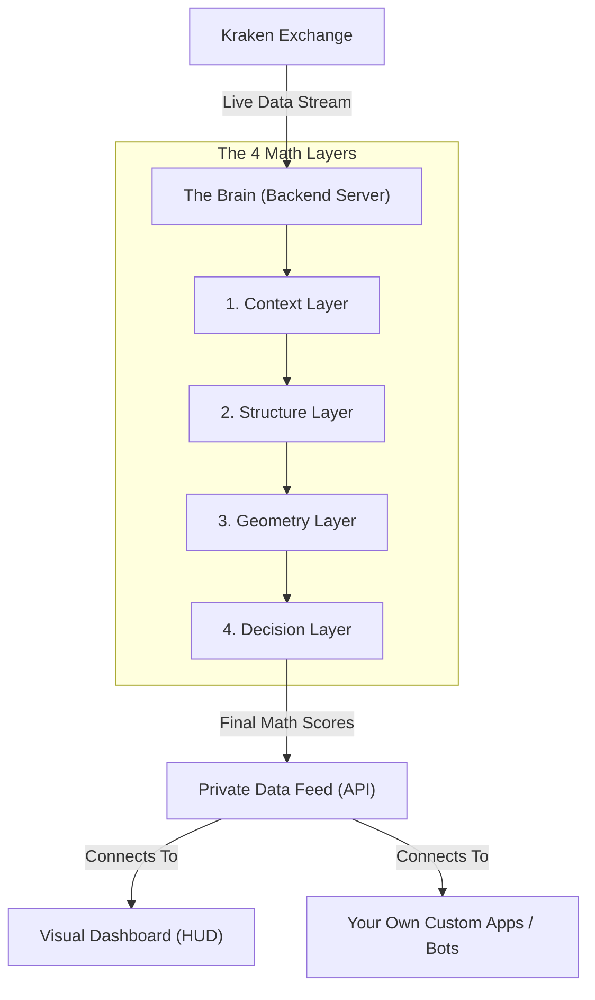

# Analytical HUD — Client User Guide

Welcome to the **Analytical HUD (Heads-Up Display)**! This document is your complete guide to understanding our market analysis system. Whether you are a trader looking at the visual dashboard, or a business owner connecting our data to your own apps, this guide explains exactly what we do and how to use it.

---

## 1. What is the Analytical HUD?
The Analytical HUD acts as a supercomputer "brain" for cryptocurrency markets. It continuously connects to real-world exchanges (like Kraken) to pull live data on assets like Bitcoin. Every 2 seconds, it processes this data through **15+ mathematical engines**.

Instead of staring at standard charts and guessing what will happen next, the HUD does the heavy lifting for you. It provides mathematical certainties: precise probabilities, calculated risk limits, and underlying structural maps.

**Important Note:** This is exclusively an analytical tool. It does not automatically place trades for you or manage your funds. It is simply designed to give you an unfair advantage by processing complex market data much faster than a human can.

---

## 2. The Visual Dashboard
If you open our web interface, you will see several powerful tools that visualize the math happening in the background:

- **Volatility Gauges**: A live dashboard that instantly tells you if the market is currently *High, Normal, Low, or Extreme* risk.
- **Liquidity Maps**: Visual "heat zones" showing exactly where other traders' stop-losses are hiding. Price often acts like a magnet pulling toward these zones.
- **Market Trends**: Instant detection telling you if the current price is in a "Premium" (too expensive) or "Discount" (cheap and safe) zone.
- **System Health Monitor**: A panel that ensures you are receiving data with zero delay.

---

## 3. Key Metrics Explained Simply
We use advanced statistics to give you simple signals. Here is a breakdown of the main terms you will encounter:

- **Prediction Bands:** Instead of guessing a single direction, our main graph draws three "probability bands" (50%, 80%, and 95% confidence). This shows you the likely *range* where the price is heading.
- **Expected Drawdown (EDD):** This is a critical safety net. It mathematically predicts exactly how much pain (price dropping against you) you might have to endure before the price finally moves in your favor. 
- **Safety Overrides (Hard Rejects):** If the market becomes too chaotic or dangerous, our software will enter an **IDLE state** and refuse to generate signals. It will plainly tell you why in English (e.g., *"Global Stress is CAUTION"* or *"Win probability is below 80%*").
- **Divergence:** Identifies fake market movements. For example, if the price is going up, but the actual volume of buying pressure is dropping, the system flags this as a trap.

---

## 4. How the "Brain" Works: The 4 Layers
Every 2 seconds, our system runs through four intelligence layers in a strict order:

1. **Context Layer**: Assesses the "Global Battlefield." It checks for macro-economic stress and whether it's daytime in major financial hubs like London or New York.
2. **Structure Layer**: Identifies the local terrain. It finds where the immediate hurdles (support and resistance) are.
3. **Geometry Layer**: Analyzes micro-movements of price action, looking closely at how rapidly individual candles are shifting.
4. **Decision Layer**: Weighs everything together to calculate the final probability score and give a strict Go/No-Go safety check.

---

## 5. Behind the Scenes (Technical Mechanics & Formulas)

### 🏗️ The System Architecture Diagram
Here is a visual breakdown of how data moves from the real world into the mathematical "Brain," and finally out to your dashboard:



For clients passing this documentation to their quantitative teams or developers, here is the pure mathematics our engines calculate natively without human bias:

- **Average True Range (ATR):** The root of all our volatility math. We use a 14-period true range to measure how wildly the asset is swinging organically.
  *Formula used natively:* `TR = Max( (High-Low) , |High - PrevClose| , |Low - PrevClose| )`
- **Expected Drawdown (EDD):** 
  *Formula used natively:* `EDD = ATR × Volatility Factor`
- **Volatility Bandwidth**: Assesses how wide price is swinging relative to its overall price index to dictate structural stress.
  *Formula used natively:* `Bandwidth = (High - Low) / Close`
- **Expected Value (EV):** The ultimate statistical grade. At its core, EV evaluates whether taking a specific action is mathematically profitable over 100 repeated attempts.
  *Formula used natively:* `EV = (Win Probability % × Target Distance) - (Loss Probability % × Stop Distance)`

*Architecture Note:* The frontend visual interface is completely decoupled from the mathematical backend loop. The Backend runs a strict, uninterrupted 2000ms loop to prevent UI lag.

---

## 6. Connecting Other Apps (The API)
If you are a business user and want our system to "talk" directly to your own automated systems or trading bots, you can securely access our raw data feeds (called an API). Think of the API as a dedicated, private telephone line between our "Brain" and your software.

### Security and Limits
- **Digital ID Badge (Authentication):** To use the private data feeds, your software must pass a specific `Bearer Token` inside the HTTP Authorization Header.
- **Speed Limits:** To keep our servers from overheating, you are allowed to ask for data **60 times per minute**.

### The 3 Main Data Feeds Your Developer Can Connect To:

#### 1. The Real-Time Feed (Live Market Analysis)
**`GET /api/v1/analysis/live?symbol=BTC-USDT&timeframe=1m`**
- **What it does:** This acts like a hyper-fast ticker tape. Your app asks "What is Bitcoin doing right now?" and our system answers immediately.
- **What your app receives:** A dense JSON package containing exact numbers. Key variables to look for include:
  - `prediction` variables holding the confidence bands.
  - `risk.edd` containing your strict drawdown limit.
  - `liquidity.zones` marking the exact price boundaries of hidden volume.
  - `state.rejectReasons` outlining why safety checks failed.

*(If you are sending this manual to a developer or programmer, this is the exact code they will use to connect to the feed):*
```bash
curl -X GET "http://localhost:3000/api/v1/analysis/live?symbol=BTC-USDT&timeframe=1m" \
     -H "Authorization: Bearer YOUR_SECRET_TOKEN"
```

#### 2. The Scanner Feed (Multi-Symbol Summary)
**`GET /api/v1/analysis/dashboard`**
- **What it does:** If your app wants to scan 10 different markets at the exact same moment without pulling heavy data, it uses this feed instead.
- **What your app receives:** High-level status flags (e.g., Volatility Regimes, Geometry States) across all tracked assets without the heavy structural payload.

#### 3. The Health Feed (System Diagnostics)
**`GET /api/v1/diagnostics/performance`**
- **What it does:** This feed acts purely as a heart monitor for the system.
- **What your app receives:** Speed statistics (`P50, P95, P99`) telling your bot exactly how fast our server is responding in milliseconds. This ensures your bot never trades on delayed or lagging data.

---

## 7. Customization & Modification Guide
Because the software uses a modular "Engine" architecture, it is incredibly easy for your development team to alter how the math behaves. Here is how you can customize the system:

#### A. Changing Safety Levels (Risk Tolerance)
By default, the system has strict "Hard Reject" safety rules (e.g., it goes IDLE if your win probability drops below 80% or if the Expected Drawdown is too high).
- **How to alter it:** A developer can open `PipelineOrchestrator.ts` or `RiskManager.ts` to freely alter the thresholds. For example, if you want a riskier, highly aggressive strategy, they can lower the required win probability from `80` to `65`.

#### B. Altering the Coin/Market Feed
By default, the HUD looks at Bitcoin (`BTC-USDT`) on a 1-minute chart from Kraken.
- **How to alter it:** If you want to analyze Ethereum instead, simply pass different query parameters to the API (e.g., `symbol=ETH-USDT` and `timeframe=5m`). To pull data from Binance instead of Kraken, a developer can build a `BinanceAdapter.ts` file and plug it in seamlessly.

#### C. Adjusting the Math & AI Weights
The ultimate Probability Score is generated using dynamically weighted coefficients tied to things like Volume, Trend, and Volatility.
- **How to alter it:** A developer can edit `PredictionEngine.ts` to change how much the "Brain" values certain data. For instance, if you want the system to care 90% about *Liquidity Zones* and only 10% about *Volatility*, they simply adjust the internal engine multipliers.

#### D. Changing the Core Mathematical Formulas
If your quantitative team determines that the default math logic (such as the 14-period ATR or the standard Expected Value equations highlighted in Section 5) needs to be deeply customized:
- **How to alter it:** A developer can open the core engine files directly—such as `RiskManager.ts` (for EV and EDD calculations) or `VolatilityRegimeEngine.ts` (for ATR and bandwidth logic). Because the architecture is completely modular, altering these base formulas will automatically seamlessly ripple down into the final HUD outputs without requiring a full system rewrite.

#### E. Redesigning the Visual Dashboard
- **How to alter it:** Because the visual Frontend is entirely decoupled from the math Backend, your web developers can go into the `frontend/` folder and completely redesign the website (adding your own company branding or removing specific panels) without breaking any of the underlying calculations.

---

## 8. Deploying to the Web (Making it Public)
If you want to move the software off your personal computer and host it live online so anyone can view the dashboard anywhere in the world, the decoupled architecture makes this incredibly easy.

Because the system is split into two halves, you will host them on two different platforms:

**1. Hosting the "Brain" (The Backend Engine)**
The backend Node.js server needs a stable environment to run its 24/7 calculations continuously.
- **Recommended Platform:** [Render.com](https://render.com) or [Heroku](https://heroku.com).
- **How to do it:** Simply connect your GitHub repository to Render as a "Web Service". Render will automatically detect the Node.js environment, install the math engines, and start running the pipeline permanently.

**2. Hosting the Visual Dashboard (The Frontend)**
The visual React website needs a fast web host to serve the charts to your browser.
- **Recommended Platform:** [Vercel](https://vercel.com) or [Netlify](https://netlify.com).
- **How to do it:** Connect your GitHub repository to Vercel. Tell Vercel to look specifically at the `frontend` folder. It will automatically build the website and give you a live public link (e.g., `your-dashboard.vercel.app`), which you can later attach to your own custom `.com` domain name!

*(Tip for Developers: Keep in mind that once the Backend is hosted on Render, your developers will need to permanently point the Frontend code to pull data from your new Render URL instead of `localhost`!)*

---

## 9. Starting the Software (Locally on Your Computer)
If you have been provided with the raw software codebase to run strictly on your own computer, you will need **Node.js (version 18+)** installed.

**Step 1: Turn on the "Brain" (The Backend)**
Open a command prompt terminal inside the main `trade` folder and type:
```bash
npm install
npm run dev
```

**Step 2: Turn on the Dashboard (The Frontend)**
Open a **new, second** command prompt terminal, navigate into the `frontend` folder, and type:
```bash
cd frontend
npm install
npm run dev
```
*You can now open a web browser to `http://localhost:5173` to safely view the dashboard.*