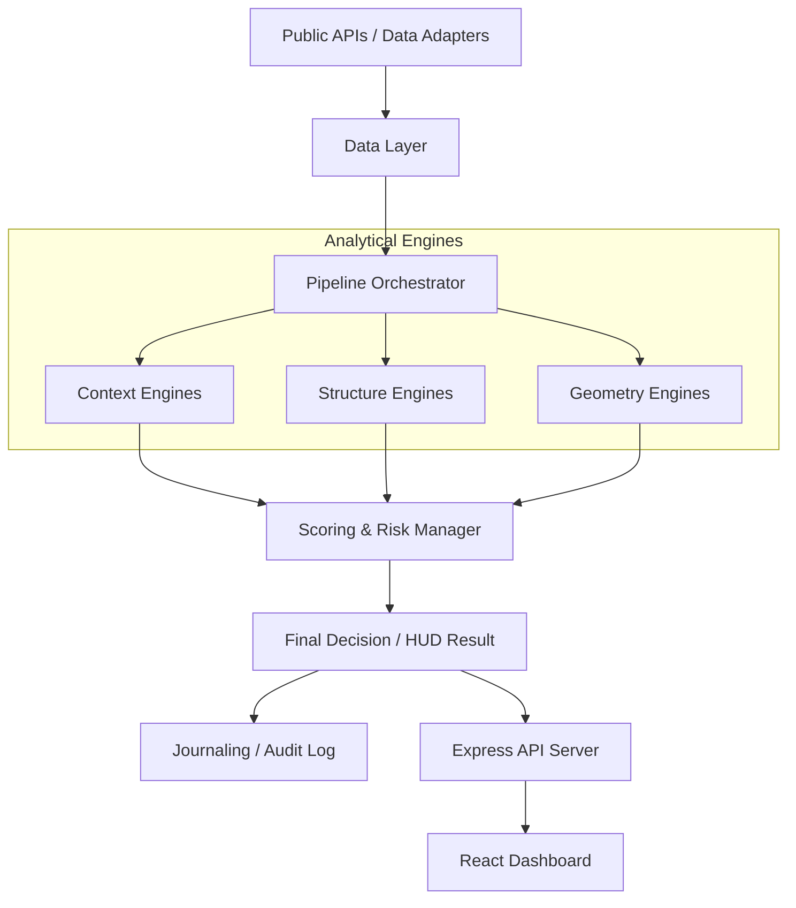

# 💎 Trade — Multi-Layer Analytical Architecture

[](https://github.com/Aman-Amarjit/Trade/actions)
[](SECURITY.md)
[](LICENSE)
[](package.json)

**Trade** is a high-performance, real-time analytics platform designed for deep market structure interpretation, breakout cycle detection, and institutional-grade risk management.


---

## 🚀 Key Features

### 🧠 Core Engine Cluster
- **Regime Intelligence**: Volatility regime detection and regime persistence tracking.
- **Liquidity Mapping**: Dynamic tracking of Fair Value Gaps (FVG), stop clusters, and liquidity shelves.
- **Geometry Classifier**: Real-time identification of market geometries and breakout cycles.
- **Risk Sentinel**: Hard rejection logic, daily drawdown caps, and EDD calculation.

### ⚡ Real-Time Pipeline
- **Low-Latency Ingestion**: Multi-symbol support with staggered polling to avoid rate limits.
- **Deterministic Replay**: Full CSV-based replay engine for backtesting and logic verification.
- **Journaling System**: Persistent auditing of state transitions and risk rejections.

---

## 🏗️ Architecture



---

## 🛡️ Security Architecture

Built with a "Security First" mindset to protect both data and proprietary logic:

- **Proprietary Core**: 100% of trading logic remains isolated on the backend.
- **Hardened API**: Protected by `helmet`, strict `CORS`, rate limiting, and Bearer authentication.
- **Sanitized Inputs**: Deep validation and sanitization of all incoming requests and market data.
- **Vulnerability Management**: Continuous dependency auditing and path-based security checks.

See [SECURITY.md](SECURITY.md) for full details.

---

## 🛠️ Getting Started

### Prerequisites

- Node.js >= 18.0.0
- NPM or PNPM

### Installation

```bash
# Install root dependencies (Backend)
npm install

# Install Frontend dependencies
cd frontend
npm install
```

### Development

| Side | Command | Description |
| :--- | :--- | :--- |
| **Backend** | `npm run dev` | Starts API with hot-reload |
| **Frontend** | `npm run dev` | Starts Vite dashboard |
| **Tests** | `npm test` | Runs Vitest suite |

---

## ⚙️ Configuration

Copy `.env.example` to `.env` and configure your environment:

| Variable | Description | Default |
| :--- | :--- | :--- |
| `API_TOKEN` | Strong bearer token for API security | `dev-token` |
| `ALLOWED_ORIGINS` | Permitted frontend domains (CORS) | `http://localhost:5173` |
| `SYMBOLS` | Comma-separated assets to track | `BTC-USDT,ETH-USDT` |
| `PORT` | Backend server port | `3000` |

---

## 📄 License

Proprietary Software. All Rights Reserved. See [LICENSE](LICENSE) for details.
